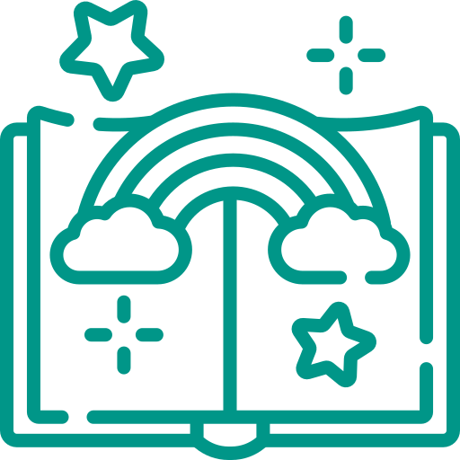

# 📖 Story App

<p align="center">
  
</p>

<p align="center">
  A Flutter-based mobile application for creating, managing, and browsing personal stories — featuring local storage, smooth animations, and a clean, expressive UI.
</p>

<p align="center">
  
  
  
  
  
</p>

---

## 📋 Table of Contents

- [About](#about)
- [Features](#features)
- [Tech Stack](#tech-stack)
- [Project Structure](#project-structure)
- [Getting Started](#getting-started)
- [Dependencies](#dependencies)
- [Assets & Fonts](#assets--fonts)
- [Screenshots](#screenshots)
- [Contributing](#contributing)

---

## About

**Story App** is a Flutter mobile application that allows users to create and manage their own stories locally on their device. Stories are persisted using the **Hive** NoSQL database, managed through the **BLoC** state management pattern, and enriched with image support via the **Image Picker** package. The app features a polished teal-themed UI with custom fonts and swipeable story cards.

---

## ✨ Features

- 📝 **Create Stories** — Write and save personal stories with titles and content
- 🖼️ **Attach Images** — Pick images from your gallery or camera to accompany each story
- 💾 **Offline Storage** — All stories are persisted locally using Hive (no internet needed)
- 🗑️ **Swipe Actions** — Swipe story cards to delete or edit them intuitively
- 📅 **Formatted Dates** — Stories display human-readable timestamps using `intl`
- ⏳ **Loading Indicators** — Smooth progress overlays during async operations
- 🎨 **Custom Fonts** — Styled with *LuckiestGuy* and *Baloo2* for a distinctive look
- 🌊 **Teal Splash Screen** — A branded native splash screen on launch
- 📱 **Cross-Platform** — Runs on both Android and iOS

---

## 🛠️ Tech Stack

| Layer | Technology |
|---|---|
| Framework | Flutter (Dart) |
| State Management | `flutter_bloc` ^8.1.3 |
| Local Database | `hive` ^2.2.3 + `hive_flutter` ^1.1.0 |
| Image Handling | `image_picker` ^1.2.1 |
| UI Extras | `flutter_swipe_action_cell`, `modal_progress_hud_nsn` |
| Date Formatting | `intl` ^0.20.2 |
| Code Generation | `build_runner` + `hive_generator` |
| App Icon | `flutter_launcher_icons` |
| Splash Screen | `flutter_native_splash` |

---

## 📁 Project Structure

```
story_app/
├── android/                    # Android platform files
├── ios/                        # iOS platform files
├── assets/
│   ├── images/
│   │   ├── AppIcon.jpg         # App icon & splash image
│   │   └── app_icon.png        # Android 12 adaptive icon
│   └── fonts/
│       ├── LuckiestGuy-Regular.ttf
│       └── Baloo2-ExtraBold.ttf
├── lib/
│   ├── main.dart               # App entry point
│   ├── models/                 # Hive data models (Story, etc.)
│   ├── cubits/ (or blocs/)     # BLoC / Cubit state management
│   ├── views/ (or screens/)    # UI screens
│   └── widgets/                # Reusable UI components
├── test/                       # Unit & widget tests
├── pubspec.yaml                # Dependencies & configuration
└── README.md
```

> **Note:** The `lib/` folder follows a feature-first or layer-first architecture driven by BLoC pattern. Hive adapters are generated via `build_runner`.

---

## 🚀 Getting Started

### Prerequisites

- [Flutter SDK](https://docs.flutter.dev/get-started/install) `^3.x` (compatible with Dart SDK `^3.11.4`)
- Android Studio / VS Code with Flutter & Dart plugins
- A connected device or emulator

### Installation

1. **Clone the repository**
   ```bash
   git clone https://github.com/AbdallaEid/Story_App.git
   cd Story_App
   ```

2. **Install dependencies**
   ```bash
   flutter pub get
   ```

3. **Generate Hive type adapters**
   ```bash
   dart run build_runner build --delete-conflicting-outputs
   ```

4. **Generate app icons & splash screen** *(optional, already committed)*
   ```bash
   dart run flutter_launcher_icons
   dart run flutter_native_splash:create
   ```

5. **Run the app**
   ```bash
   flutter run
   ```

---

## 📦 Dependencies

### Runtime Dependencies

| Package | Version | Purpose |
|---|---|---|
| `flutter_bloc` | ^8.1.3 | BLoC state management pattern |
| `hive` | ^2.2.3 | Lightweight, fast local NoSQL database |
| `hive_flutter` | ^1.1.0 | Flutter adapter for Hive |
| `image_picker` | ^1.2.1 | Pick images from gallery or camera |
| `flutter_swipe_action_cell` | ^3.1.6 | Swipeable list cells (delete/edit) |
| `modal_progress_hud_nsn` | ^0.5.1 | Loading overlay / progress spinner |
| `intl` | ^0.20.2 | Date & number formatting |
| `meta` | ^1.11.0 | Dart meta annotations |
| `cupertino_icons` | ^1.0.8 | iOS-style icons |

### Dev Dependencies

| Package | Version | Purpose |
|---|---|---|
| `build_runner` | ^2.4.8 | Code generation tool |
| `hive_generator` | ^2.0.1 | Generates Hive TypeAdapters |
| `flutter_launcher_icons` | ^0.13.1 | Generates platform app icons |
| `flutter_lints` | ^6.0.0 | Recommended lint rules |

---

## 🎨 Assets & Fonts

### Custom Fonts

| Font | Weight | Usage |
|---|---|---|
| **LuckiestGuy** | Regular | Headings, titles |
| **Baloo2** | ExtraBold | Body text, UI labels |

### App Icon & Splash Screen

- **App Icon:** `assets/images/AppIcon.jpg` (used for both Android and iOS)
- **Splash Screen Color:** `#009688` (Teal)
- **Android 12+:** Adaptive icon from `assets/images/app_icon.png` with teal background, full-screen mode enabled


---

## 🤝 Contributing

Contributions are welcome! To contribute:

1. Fork the repository
2. Create a feature branch: `git checkout -b feature/your-feature`
3. Commit your changes: `git commit -m 'Add some feature'`
4. Push to the branch: `git push origin feature/your-feature`
5. Open a Pull Request

---

## 📄 License

This project is for personal/educational use. No license file has been specified.

---

<p align="center">Made with ❤️ using Flutter</p>